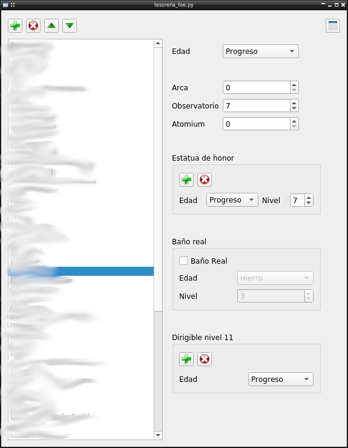

# Forge of Empires Guild Tools
Graphical tool for managing a guild in Forge of Empires

## Requirements
* `python3 <https://www.python.org/>`, version 3.x required
* `pip <https://pypi.org/project/pip/>`, python package installer

## Dependencies
* `pip install -r requirements.txt`

## Getting started

Download the files from the repository (or `git clone`)  
Install the dependencies as mentioned above  
Run the file `tesorereria_foe.py`:
* `python tesorereria_foe.py`

