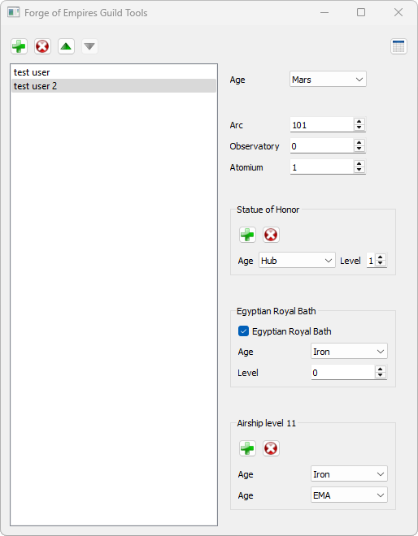

## Forge of Empires Guild Tools
Graphical tool for managing a guild in Forge of Empires by [slindenau](https://github.com/s-lindenau).  
This tool was originally inspired by [jjgomera/tesoreria_foe](https://github.com/jjgomera/tesoreria_foe). 

### Overview
All-in-one GUI overview to manage your guild and determine the least active members (to warn or kick)
* View guild members and their contributions
* View guild member activity in GE, GbG and Qi
* View guild treasury status and member donations
* Various other tools and overviews, like:
  * Configurable rules for your guild requirements on minimal activity, contributions etc.
  * Number of level 80+ Arcs in the guild, list of members without a level `x` Arc

### Requirements
#### Functional
* Be a Leader of a guild in Forge of Empires
* Play with the [FoE-Helper](https://foe-helper.com/) browser extension (at least gather the data before starting a members analysis)
  * Visit the guilds members page for the data to be collected
  * Visit GE, GbG and Qi results at the end of a season for the activity data to be collected 
  * Visit individual guild members cities for their buildings data to be collected
  * Visit the guild treasury page for the stock and donations data to be collected
* For a "light" review, at least visit:
  * Guild members list, Guild treasury overview
  * GE, GbG and Qi results
* For a "full" review also visit:
  * Individual guild member cities
  * Guild treasury donations history

#### Technical
* `python3 <https://www.python.org/>`, version 3.x required
* `pip <https://pypi.org/project/pip/>`, python package installer

### Dependencies
For installing the python dependencies this tool requires, run the following command after downloading the project:
* `pip install -r requirements.txt`

### Getting started
Download the files from the repository (ZIP, GitHub Desktop or `git clone`)  
Install the dependencies as mentioned above  
Run the file `tesorereria_foe.py`:
* `python tesorereria_foe.py`

### Downloading FoE-Helper data
To get the data of your guild members, you need to use the FoE-Helper browser extension.
* Play the game in a browser with the extension enabled
* Export the following files from the extension:
  * FoE-Helper: Settings -> Tab "Other" -> Scroll down -> Import/Export -> Open tool -> Tab "Export" -> (Select items) -> Export to ZIP
    * **Required**: GuildMemberStat
    * **Required**: GexStat
    * **Required**: GuildFights
    * **Required**: Qi
    * _Optional: Events_
    * _Optional: FPCollector_ 
  * FoE menu: Global -> Guild -> Top left `≡` button -> Guild Contributions -> Browse all pages you want to analyze -> Export to CSV with FoE-Helper

### Screenshots

